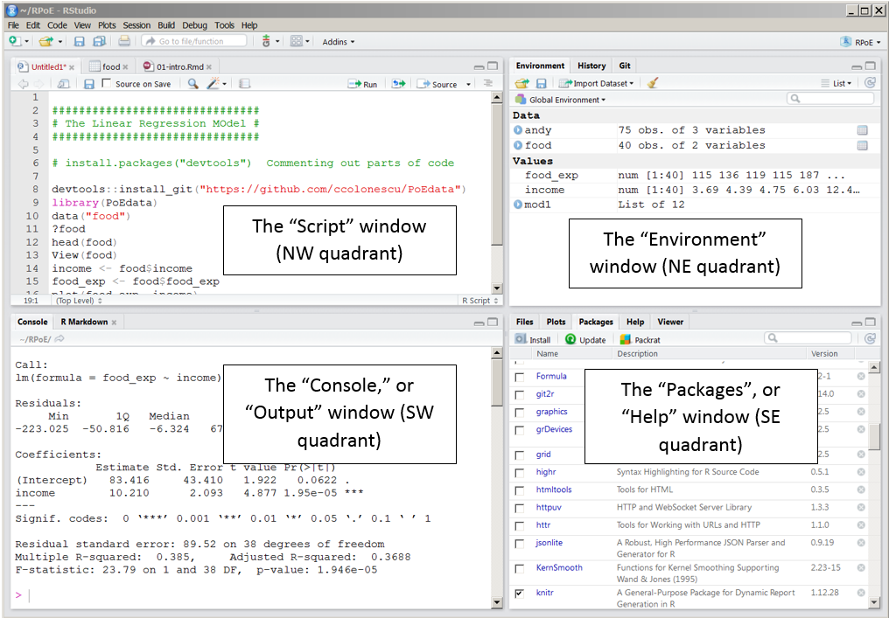

# Module 1: Welcome to R
## Hawken Hass
## University of North Carolina Wilmington

# Familiarizing Yourself with RStudio


  In this document you will learn the basic set up and language used in RStudio. This document will familiarize you with the interface so you can easily work through these modules. The most important step is to install R and RStudio. If you haven't done so, follow this link:

<https://www.r-project.org/>


## Opening RStudio

When you first open RStudio you will be presented with four quadrants on your screen.


 
In the top left quadrant is the "command center". This is where you will type in your code. To  execute a function simply type the code on any line and hit "control + enter" to run the code. If you start typing code R will often assist you in finishing the code. If you enter just part of the code you will be presented with a drop down menu of different options of code. Hitting "tab" on your keyboard will automatically input the rest of the code.

In the bottom left quadrant is the "console". In the console you will see your output. First you will see the exact code you typed in the command center. You will then see the corresponding output of that code. For instance, if you ran a certain statistical test, the results of that test will be presented in the console. There are some instances where no output will appear on the screen, just an exact copy of your code.

In the top right is your "global environment". Your global environment shows all values and data you have imported into R using the command center.


From running the above code you can see how the console and global environment has changed. As you can see, I defined x as 15. This is reflected in our global environment. If you look below at the console you will also see that the line of code I ran is repeated in the output. If I just run the variable x, the output comes up as 15.


 
 
 Finally, in the bottom right corner we have a quadrant with five separate tabs.

**Files**
 
This shows you all files the are available to you as a user of R. This is another way you can import data and set your working directory.
 
 **Plots**
 
The plots tab shows you all of the graphs or plots you have generated using your code. You can select the arrows to shift back and forth between each graph. You can also export and save your graph using this tab.
 
 **Packages** 
 
The packages tab allows you to install, activate, and update certain packages. Packages allow you to run certain functions. The list shows you all of the packages that you have installed, and clicking the check mark activates the package. If you need to install a new package you can hit the install button on the top left corner. There you can search for the package you need and install it. You will need to activate each package you need during each R session and prior to running the subsequent function.
 
 **Help**
 
The help tab allows you to search for a particular code, term, concept, or any other help directly from the RStudio app.
 
 **Viewer**
 
In the Viewer tab you can view local web content.
 

# R Language

## Data Structures
 
 Now that you are familiar with the set up of R, it is important to learn the vocabulary the comes along with the interface. Next module I will introduce the code needed to create these objects in Rstudio.
 
 **Vector**

A vector is a data structure. It contains elements of the same type in a sequence.
 
An example of a vector would be:An example of a vector would be:
```{r}
vector<-c(1,2,3,4,5,6)

```
As you can see, this vector is numeric. Vectors could be any type of variable as long as each data point is the same type.

**Matrices**

A matrix is another type of data structure in R. It can be a combination of two or more vectors and has two dimensions: rows and columns. A matrix looks like this:
```{r}
matrix<- matrix(vector, nrow = 3, ncol=2, byrow=TRUE)

```


**Lists**

A list is a data structure that contains different types of elements. For example you could have numeric and nominal variables. 

```{r}
list<-list("List 1"=1,2,3, "List 2"="a", "b", "c")
```

**Array**


An array is similar to a matrix but has a third dimension. It is essentially a bunch of stacked matrices.

```{r}
vector<-c(1,2,3,4,5,6)
vector2<-c(7,8,9,10,11,12)
Array<-array(c(vector, vector2), dim=c(4,4,3))

```
## Variable Types

**Character**

A character variable is a letter or string of letters.

**Numeric**

Any variable that is a number.

**Integer**

Any numeric variable that can only be a whole number (no decimals). 

**Logical**

Variables that can only be true or false. They typically indicate if a condition is true or false.

**Complex**

These variables involve a numeric variable with an the imaginary value "i". 

# Summary

## Data Structures

The table below summarizes the data structures often used in R.

Dimension | Homogeneous | Heterogeneous
----------| ----------  | -------------
One |Atomic Vector|  List
Two |    Matrix   |  Data Frame
Three| Array|

Homogeneous means that the variable type must be the same type for each variable, whereas heterogeneous means that the data structure can contain multiple different types of data. 

## Variable Types

The table below summarizes variable types often used in R.

Variable Type|Example  |
-------------|---------|
Character| "A", "B", "C"|
Numeric| 1, 2.5, 3|
Integer| 10, 20 ,30|
Logical| True, False|
Complex| 4+6i|


# Practice!

Make each of the data structure types using your own numbers. Copy and paste the code below into your own R session and analyze the output.

```{r}
Practice_vector<-c()
Practice_matrix<-matrix()
Practice_list<-list()
Practice_array<-array()
```

Now run the following code to see the output for each data type. This will show you what each data structure type looks like.

```{r}
print(Practice_vector)
print(Practice_matrix)
print(Practice_list)
print(Practice_array)
```
